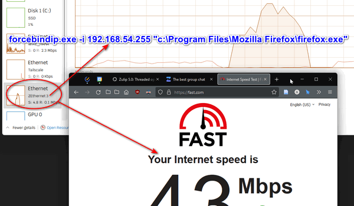

force app to use specific network adaptor
e.g. you have 2 network adaptor
- WIRE_HANA company network that block many site
- ZEThernet3 is mobile tether network through USB cable

you can bind firefox web browser to ZEthernet3 only so you can unblock
- check you mobile adapter gateway ip (this case is 192.168.54.255)
- run `forcebindip.exe -i 192.168.54.255 "c:\Program Files\Mozilla Firefox\firefox.exe"`
- open task manager, go to fast.com and check that data is go through mobile tether

https://github.com/mhasanjb/ForceBindIP-Gui
